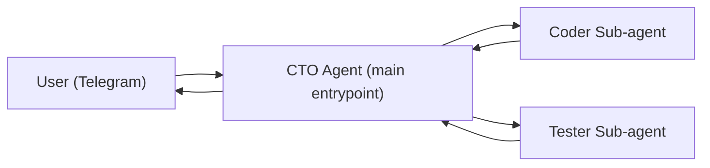

# Build a CTO Agent in OpenClaw: Create New Agents from Plain-Language Requests

You already have OpenClaw running.  
Now the next pain starts: every new agent still feels like manual engineering.

This article introduces a practical pattern: **one CTO Agent** that talks to non-technical users, converts requests into structured tasks, and drives agent creation with sub-agents behind the scenes.

---

## Overview

This is a concept + implementation draft for teams who want to automate agent creation without turning users into DevOps engineers.

What you will get:

- A clear problem statement.
- A simple architecture for a CTO Agent in OpenClaw.
- Prompt and config examples you can adapt quickly.
- A lightweight rollout checklist.

What we are **not** doing here:

- Deep sub-agent design (Coder/Tester internals).
- Full orchestration mechanics and advanced guardrails.

We will cover those in the next article.

---

## [TODO] Screenshots Block (insert near top)

Add your visuals here:

1. **Telegram chat** where user asks for a meeting-booking agent in plain English.
2. **CTO Agent response** with intake questions and status updates.
3. **Result** showing the new working agent created from prompts.

Suggested captions:

- “From idea to working agent via CTO orchestration.”
- “Non-technical intake flow in Telegram.”
- “No manual JSON editing in the happy path.”

---

## The Problem (in plain language)

Most teams can run OpenClaw.  
Few teams can **consistently create new agents** without breaking runtime config.

Typical issues:

- Requirements arrive in human language, but implementation needs strict config.
- People mix live `openclaw.json` edits with incomplete testing.
- Agent creation depends on one technical person who understands all internals.
- Users want progress updates, but orchestration often goes silent mid-run.

The result is slow delivery and fragile setups.

---

## The Solution: CTO Agent as an Orchestrator Layer

Treat “agent creation” as a product workflow, not a one-shot prompt.

The CTO Agent should:

1. Accept high-level user requests.
2. Run a short non-technical intake (goal, trigger, channel, done criteria).
3. Convert that into an execution brief.
4. Delegate build + validation to sub-agents.
5. Keep user-facing communication concise and frequent.
6. Return a final report with decision and next action.

In short: user talks to one agent; system work happens behind it.

---

## Tiny Architecture Diagram



---

## Minimal Interaction Contract

The CTO Agent should always produce:

- `CTO_ACK` right after intake starts.
- Short progress updates during execution.
- `FINAL_REPORT` with decision: `APPROVED`, `NEEDS_FIX`, or `BLOCKED`.

This makes the system understandable for non-technical users.

---

## Prompt Blueprint (CTO Agent)

Use this as a base and adjust tone/policies:

```text
You are CTO Agent in OpenClaw.
Your mission: turn plain-language requests into production-safe agent implementations.

Rules:
1) Run a short intake first. Ask only organizational clarifiers:
   - desired behavior ("what should be done")
   - where it should run (chat/group/topic/channel)
   - success criteria ("how we know it's done")
2) Do not ask implementation-level questions unless truly blocking.
3) Delegate implementation to Coder, then validation to Tester.
4) If Coder/Tester fails, continue the loop and retry with precise rework instructions.
5) Keep user updated with short status messages.
6) Hide low-level noise from users; summarize outcomes.
7) End with FINAL_REPORT including decision, summary, risks, and next action.
```

---

## Example OpenClaw Config Snippet (conceptual)

This is intentionally short and readable:

```json
{
  "agents": {
    "list": [
      { "id": "main", "default": true, "workspace": "~/.openclaw/workspace/workspace-main" },
      { "id": "cto", "workspace": "~/.openclaw/workspace/workspace-cto" },
      { "id": "coder", "workspace": "~/.openclaw/workspace/workspace-engineering/coder" },
      { "id": "tester", "workspace": "~/.openclaw/workspace/workspace-engineering/tester" }
    ]
  },
  "bindings": [
    {
      "agentId": "cto",
      "match": {
        "channel": "telegram",
        "peer": { "kind": "group", "id": "-100XXXXXXXXXX:topic:2" }
      }
    }
  ]
}
```

Key point: users enter through `cto`, not directly through coder/tester.

---

## Simple Rollout Steps

1. Create `workspace-cto` with a strict `IDENTITY.md` for orchestration behavior.
2. Configure CTO binding to your Telegram group/topic.
3. Keep coder/tester callable only by CTO policy.
4. Define required report formats (`CTO_ACK`, `AGENT_RUN_CARD`, `FINAL_REPORT`).
5. Run one simple scenario end-to-end.

Example user request:

> “I want an agent that reads OpenClaw news every morning and sends me a summary.”

Expected CTO behavior:

- asks a few business-level clarifiers,
- starts implementation loop,
- reports outcome in plain language.

---

## Why This Works

- Non-technical users talk in outcomes, not configs.
- CTO Agent keeps system state organized.
- Sub-agent complexity stays internal.
- Delivery becomes repeatable.

This pattern reduces “prompt chaos” and creates a real workflow.

---

## Common Pitfalls (quick list)

- CTO asks too many technical questions during intake.
- Users see raw sub-agent dumps instead of concise summaries.
- Live config is changed before validation gates pass.
- No clear final decision format.

Fix these first before adding advanced autonomy.

---

## What’s Next (teaser for next article)

In the next part, we will go deep on:

- Coder sub-agent structure and safe implementation workflow.
- Tester sub-agent gates (including JSON/config QA).
- Orchestration loop design (retry logic, failure classes, stop conditions).
- Practical guardrails and cost-aware model routing.

---

## Draft Notes

- [TODO: align final title with your publishing style]
- [TODO: replace conceptual JSON with your exact production snippet]
- [TODO: insert 2-3 screenshots from your meeting-booker flow]
- [TODO: add links to next-part articles when ready]
