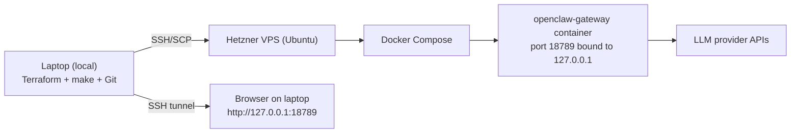

# Title Options

1. **OpenClaw on Hetzner: deploy your personal AI agent for a few dollars**
    
2. **Don’t buy a Mac mini: OpenClaw on a cheap VPS (step-by-step)**
    
3. **From pain to victory: launching OpenClaw on Hetzner (real pitfalls included)**
    
4. **OpenClaw on Hetzner: a practical deployment playbook**
    
5. **Budget AI agent: OpenClaw on Hetzner, done the sane way**
    

## Table of contents

1. What you’re building (in plain English)
    
2. Business cost (monthly VPS vs hardware)
    
3. What’s running where? (tiny diagram)
    
4. What you need before you start
    
5. Quick glossary: tokens, keys, fingerprints
    
6. Step-by-step deployment
    
    1. Get the codebase (repo)
        
    2. Install local tools
        
    3. Prepare Hetzner: API token + SSH key
        
    4. Fill the project config files
        
    5. Provision the server with Terraform
        
    6. Bootstrap + deploy OpenClaw
        
    7. Open the dashboard safely (SSH tunnel)
        
    8. Pair devices + Telegram
        
    9. Check the model + run a smoke test
        
7. Pitfalls & fixes (real errors)
    
8. Git workflow (safe changes)
    
9. Security (minimum sane hardening)
    
10. Final checklist
    
11. Quick start (TL;DR)
    
12. What to improve in v2
    

---

## What you’re building (in plain English)

You’re setting up **OpenClaw Gateway** (the “brains + control panel” for your AI agents) on a **cheap Hetzner VPS**, using:

- **Terraform** to create the server & firewall repeatably (no clicking around every time),
    
- **Docker Compose** to run OpenClaw in a container,
    
- **SSH tunnel** so the dashboard is **not exposed to the public internet**.
    

End result:

- OpenClaw runs 24/7 on a VPS.
    
- You open the UI locally at `http://127.0.0.1:18789` via tunnel.
    
- Your model (e.g., OpenAI) is configured and a smoke test returns `OPENCLAW_OK`.
    

And yes — people go buy Mac minis for “AI agents”… but this whole setup runs fine on a VPS that costs coffee money. 🙂

---

## Business cost (monthly VPS vs hardware)

Here’s the practical budget picture:

- Hetzner entry cloud plans are in the low single-digit USD/EUR monthly range (for example, official pricing updates list plans around **$5.49–$6.99/month** depending family/region and effective date).
- Apple lists Mac mini starting at **$599 (US)**.

So even if you choose a bigger VPS than entry-level (for example ~$10–$20/month for comfort), that is still years of hosting before you reach equivalent hardware spend — and without upfront hardware purchase.

Quick reality check: pricing changes over time, so verify current prices on:

- [Hetzner pricing docs](https://docs.hetzner.com/general/infrastructure-and-availability/price-adjustment/)
- [Apple Mac mini pricing](https://www.apple.com/mac-mini/)

---

## What’s running where? (tiny diagram)



---

## What you need before you start

### Accounts (you must have)

- A **Hetzner Cloud** account + a Project.
    
- At least one **LLM provider** key:
    
    - `OPENAI_API_KEY` (recommended in our run),
        
    - or `ANTHROPIC_API_KEY`, etc.
        

### Your computer (where you run Terraform + deploy scripts)

- macOS / Linux / Windows (WSL is fine).
    

### Required local tools

- `git`
    
- `terraform`
    
- `make`
    
- `ssh`
    
- `jq` (for one convenience command)
    

> If something is missing, the guide below tells you **where to install it**.

---

## Quick glossary: tokens, keys, fingerprints

This is where non-technical readers usually get stuck. Here’s the “human” mapping:

### 1) Hetzner API token (`HCLOUD_TOKEN`)

**What it is:** a password-like token that lets Terraform create servers in your Hetzner project.  
**Where to get it (UI):** Hetzner Console → your Project → **Security** → **API tokens** → _Generate API token_.  
**Important:** don’t post it anywhere, don’t commit it.

### 2) SSH key + fingerprint (`TF_VAR_ssh_key_fingerprint` and `OPENCLAW_SSH_KEY`)

**SSH key** = how you log into the server without passwords.

- `OPENCLAW_SSH_KEY` is the **path to your private SSH key file** on your laptop (example: `~/.ssh/id_ed25519`).
    
- `TF_VAR_ssh_key_fingerprint` is the **fingerprint** (a short ID) of the **public** key you uploaded to Hetzner.
    

**Why this matters:**  
If the fingerprint points to one SSH key, but your deploy scripts use a different private key, you’ll get password prompts or “permission denied”. This was a major real-world pitfall.

**Where to get the fingerprint (reliable method):** run the API query from this guide (copy-paste).  
_(UI location is usually Hetzner Console → Security → SSH Keys, but if you don’t see the fingerprint clearly, use the API command below.)_

### 3) Gateway token (`OPENCLAW_GATEWAY_TOKEN`)

**What it is:** a password for the OpenClaw dashboard.  
**Where to get it:** you generate it yourself (example command below).  
**Rule:** treat it like a password.

### 4) Provider key (`OPENAI_API_KEY`, `ANTHROPIC_API_KEY`, …)

**What it is:** the key that pays for and authorizes model requests.  
**Where to get it:** provider dashboard (OpenAI/Anthropic).  
**Real-world gotcha from our run:** a typo like `k-proj-...` instead of `sk-proj-...` will cause a `401 Incorrect API key` and nothing works.

---

# Step-by-step deployment

## 1) Get the codebase (repo)

**Run on your laptop (LOCAL):**

git clone https://github.com/smart-spine/openclaw-multiagent.git  
cd openclaw-multiagent

---

## 2) Install local tools

### Terraform (LOCAL)

- macOS (Homebrew):
    

brew tap hashicorp/tap  
brew install hashicorp/tap/terraform

- Ubuntu (LOCAL): Terraform is often **not** in the default repo. Use the official HashiCorp repo method (high-level steps):
    
    1. install prereqs (`gnupg`, `software-properties-common`),
        
    2. add HashiCorp GPG key,
        
    3. add HashiCorp apt repo,
        
    4. `sudo apt update`, then install `terraform`.
        

_(If you skip this and do `apt-get install terraform`, it often fails — that’s why we call it out explicitly.)_

### jq (LOCAL)

- macOS:
    

brew install jq

---

## 3) Prepare Hetzner: API token + SSH key

### 3.1 Create Hetzner API token (UI)

1. Hetzner Console → pick your Project
    
2. **Security** → **API tokens**
    
3. Generate a token and copy it (you’ll paste it into `HCLOUD_TOKEN`)
    

### 3.2 Make sure you have an SSH key pair (LOCAL)

If you already have `~/.ssh/id_ed25519` (or similar), you can skip this.

Otherwise, create one:

ssh-keygen -t ed25519 -C "openclaw-hetzner"

When it asks where to save, the default is usually fine.

### 3.3 Upload the public SSH key to Hetzner (UI)

1. Hetzner Console → Project → **Security** → **SSH Keys**
    
2. Add the **public** key (usually `~/.ssh/id_ed25519.pub`)
    

> Important: Hetzner warns that adding a key “does not affect existing resources”. That means: if you created a server _before_ adding the key, it won’t magically appear on that server. This was a real “why is SSH asking for a password?!” moment.

### 3.4 Get the SSH key fingerprint (RELIABLE METHOD)

**Run on your laptop (LOCAL)** after you’ve created `HCLOUD_TOKEN`:

```bash
curl -s -H "Authorization: Bearer $HCLOUD_TOKEN" \
  https://api.hetzner.cloud/v1/ssh_keys | jq '.ssh_keys[] | {name, fingerprint}'
```

Copy the fingerprint for the key you uploaded — that’s what Terraform will use.

---

## 4) Fill the project config files

You’ll fill **two** files:

- `config/inputs.sh` (infra + SSH info),
    
- `secrets/openclaw.env` (runtime secrets, model key).
    

### 4.1 Infrastructure inputs (LOCAL)

cp config/inputs.example.sh config/inputs.sh

Open `config/inputs.sh` and fill it like this (replace only values in `<...>`):

```bash
#!/usr/bin/env bash
# Copy to config/inputs.sh and fill values:
#   cp config/inputs.example.sh config/inputs.sh
# Then load before running terraform:
#   source config/inputs.sh

# Required: Hetzner Cloud API token
# https://console.hetzner.cloud/ -> Project -> Security -> API Tokens
export HCLOUD_TOKEN="<HETZNER_API_TOKEN>"
export TF_VAR_hcloud_token="$HCLOUD_TOKEN"

# Required: fingerprint of existing SSH key in Hetzner
# curl -s -H "Authorization: Bearer $HCLOUD_TOKEN" https://api.hetzner.cloud/v1/ssh_keys | jq '.ssh_keys[] | {name, fingerprint}'
export TF_VAR_ssh_key_fingerprint="<SSH_KEY_FINGERPRINT>"

# Restrict SSH ingress to your IP(s)
# Recommended static IP: export TF_VAR_ssh_allowed_cidrs='["203.0.113.10/32"]'
# Dynamic IP fallback (less secure): export TF_VAR_ssh_allowed_cidrs='["0.0.0.0/0"]'
export TF_VAR_ssh_allowed_cidrs='["0.0.0.0/0"]'

# Optional server sizing/location (cheap default)
export TF_VAR_server_type="cx23"
export TF_VAR_server_location="nbg1"

# Optional overrides
export TF_VAR_project_name="openclaw"
export TF_VAR_app_user="openclaw"
export TF_VAR_app_directory="/home/openclaw/.openclaw"

# Optional runtime for scripts/Makefile
export OPENCLAW_SSH_USER="openclaw"
export OPENCLAW_SSH_KEY="$HOME/.ssh/openclaw_deploy"
```

Critical: `OPENCLAW_SSH_KEY` must match the key behind `TF_VAR_ssh_key_fingerprint`, or SSH auth will fail.
    

### 4.2 Runtime secrets (LOCAL)

cp secrets/openclaw.env.example secrets/openclaw.env

Fill `secrets/openclaw.env` like this (replace only values in `<...>`):

```bash
# Copy to secrets/openclaw.env and fill values.
# This file is pushed to VPS as ~/openclaw/docker/.env

# Required gateway auth token (generate with: openssl rand -hex 32)
OPENCLAW_GATEWAY_TOKEN=<RANDOM_GATEWAY_TOKEN>

# Optional alternative auth mode
# OPENCLAW_GATEWAY_PASSWORD=CHANGE_ME

# Gateway runtime
OPENCLAW_GATEWAY_BIND=lan
OPENCLAW_GATEWAY_PORT=18789

# Host paths on VPS
OPENCLAW_CONFIG_DIR=/home/openclaw/.openclaw
OPENCLAW_WORKSPACE_DIR=/home/openclaw/.openclaw/workspace

# OpenClaw image version (npm package tag)
OPENCLAW_VERSION=2026.2.19-2

# Provider keys (set at least one)
ANTHROPIC_API_KEY=
OPENAI_API_KEY=<OPENAI_API_KEY>
GEMINI_API_KEY=

# Optional tool/provider keys
BRAVE_API_KEY=
GH_TOKEN=

# Optional channel tokens
TELEGRAM_BOT_TOKEN=<TELEGRAM_BOT_TOKEN>
DISCORD_BOT_TOKEN=
SLACK_BOT_TOKEN=
SLACK_APP_TOKEN=
```

If using OpenAI, verify your key is valid (`sk-...` / `sk-proj-...`) and not mistyped.

> Don’t commit `secrets/openclaw.env`. Keep it local.

---

## 5) Provision the server with Terraform

**Run on your laptop (LOCAL):**

source config/inputs.sh  
make tf-init  
make tf-plan  
make tf-apply

### If you hit: `Error: server type cx22 not found`

Switch to `cx23` (as we did) and re-apply.

After apply:

make tf-output  
make ip

You’ll get the server IP.

---

## 6) Bootstrap + deploy OpenClaw

**Run on your laptop (LOCAL):**

make bootstrap  
make deploy  
make status

What “good” looks like:

- container is `Up`
    
- gateway listens (inside the VPS)
    

### If SSH says `Connection refused`

This often happens right after provisioning; cloud-init may still be finishing. Wait 1–2 minutes and retry.

---

## 7) Open the dashboard safely (SSH tunnel)

The gateway port is bound to `127.0.0.1` on the VPS. You reach it via tunnel.

**Run on your laptop (LOCAL):**

make tunnel

Then open in your browser:

- `http://127.0.0.1:18789`
    
If you want first auth via URL (so you don't paste token manually in UI), generate tokenized URL on VPS:

```bash
# keep tunnel running in terminal A, run this in terminal B
make ssh
docker exec docker-openclaw-gateway-1 openclaw dashboard --no-open
```

Open the URL it prints (with tunnel active).  
Fallback: open `http://127.0.0.1:18789` and enter `OPENCLAW_GATEWAY_TOKEN` manually when asked.

---

## 8) Pair devices + Telegram

**Important:** the commands below are executed **on the VPS** (not your laptop).  
You have two easy options:

### Option A: SSH into the server and run commands there

**Run on your laptop (LOCAL):**

make ssh

Then on the server (VPS), run:

docker exec docker-openclaw-gateway-1 openclaw devices list  
docker exec docker-openclaw-gateway-1 openclaw devices approve --latest

### Option B: Run one-liners from your laptop without “interactive SSH”

Replace `<ip>` with your server IP:

```bash
ssh -i "$OPENCLAW_SSH_KEY" openclaw@<ip> \
  "docker exec docker-openclaw-gateway-1 openclaw devices approve --latest"
```

### Telegram pairing

If Telegram sends you a code like `N3Z3US5Z`, approve it on the VPS:

```bash
docker exec docker-openclaw-gateway-1 openclaw pairing approve telegram <PAIRING_CODE>
```

---

## 9) Check the model + run a smoke test

**Run on the VPS** (same rules as above: either `make ssh` first, or one-liners via `ssh ...`):

```bash
docker exec docker-openclaw-gateway-1 openclaw models status --json
```

Now the smoke test:

```bash
docker exec docker-openclaw-gateway-1 \
  openclaw agent --local --agent main -m "Reply with OPENCLAW_OK only" --json
```

Expected output: **`OPENCLAW_OK`**.

### The “env update” rule (super important)

If you changed `secrets/openclaw.env` and pushed it to the server, the running container **does not magically reload env vars**.

After `make push-env`, do this on the VPS:

cd ~/openclaw/docker  
docker compose up -d --force-recreate

Without `--force-recreate`, you may keep seeing old env values.

---

# Pitfalls & fixes (real errors)

### `terraform: command not found`

Terraform isn’t installed. Install it and retry.

### `Error: server type cx22 not found`

Use `cx23` (worked in our run).

### SSH asks for a password

Almost always one of these:

- `TF_VAR_ssh_key_fingerprint` points to key A, but `OPENCLAW_SSH_KEY` is key B
    
- you added SSH key in Hetzner _after_ creating the server (doesn’t affect existing resources)
    

Fix:

- verify fingerprint via the Hetzner API call
    
- verify `OPENCLAW_SSH_KEY` path
    
- if the server was created without your key, recreate it or add the key manually
    

### `ssh: connect to host ... port 22: Connection refused`

Server not ready yet / wrong IP / firewall rules not applied yet. Wait a minute, confirm the IP (`make ip`), retry.

### `unauthorized: gateway token missing` / `pairing required`

Use your `OPENCLAW_GATEWAY_TOKEN` in the UI and approve device pairing on the VPS:

```bash
docker exec docker-openclaw-gateway-1 openclaw devices approve --latest
```

### `No API key found for provider "anthropic"`

Your config expects Anthropic but no `ANTHROPIC_API_KEY` exists.  
Fix: add Anthropic key, **or** switch the config to OpenAI and provide `OPENAI_API_KEY`.

### `401 Incorrect API key provided: k-proj-...`

Real-world typo: you used `k-proj-...` instead of `sk-proj-...`.  
Fix: correct the key in `.env`, push, and **force recreate** the container.

---

# Git workflow (safe changes)

Rule of thumb:

- **everything** goes to Git **except** secrets.
    

### If you changed config (tracked files)

git add config/openclaw.json  
git commit -m "chore(openclaw): update runtime config"  
git push  
  
make push-config  
make deploy

### If you changed secrets (NOT committed)

make push-env  
  
# then on the VPS:  
cd ~/openclaw/docker  
docker compose up -d --force-recreate

---

# Security (minimum sane hardening)

- **Don’t expose the dashboard publicly.** Tunnel is safer than opening ports.
    
- Restrict SSH with `TF_VAR_ssh_allowed_cidrs` (use your IP/32).
    
- If any token ever leaked into chat/logs/screenshots — **rotate it**:
    
    - Hetzner API token
        
    - OpenAI/Anthropic keys
        
    - `OPENCLAW_GATEWAY_TOKEN`
        
    - Telegram bot token (if used)
        

---

# Final checklist

**Preflight**

-  `terraform version` works
    
-  `HCLOUD_TOKEN` created in Hetzner project (Security → API tokens)
    
-  SSH key uploaded to Hetzner project (Security → SSH Keys)
    
-  `TF_VAR_ssh_key_fingerprint` copied (preferably via the API command)
    
-  `OPENCLAW_SSH_KEY` points to the matching **private** key on your laptop
    
-  `OPENAI_API_KEY` (or other provider key) is set in `secrets/openclaw.env`
    
-  `OPENCLAW_GATEWAY_TOKEN` is set (random value)
    

**Post-deploy**

-  `make status` shows container `Up`
    
-  `make tunnel` opens `http://127.0.0.1:18789`
    
-  device pairing approved on VPS
    
-  `openclaw models status --json` looks healthy
    
-  smoke test returns `OPENCLAW_OK`
    

---

# Quick start (TL;DR)

1. `git clone ... && cd openclaw-multiagent`
    
2. Install `terraform`, `jq`, `make`, `ssh`
    
3. Hetzner: create API token + upload SSH public key
    
4. Get fingerprint via Hetzner API call (copy/paste)
    
5. Fill `config/inputs.sh` (include `OPENCLAW_SSH_KEY`)
    
6. Fill `secrets/openclaw.env` (`OPENCLAW_GATEWAY_TOKEN`, `OPENAI_API_KEY`)
    
7. `source config/inputs.sh && make tf-init && make tf-plan && make tf-apply`
    
8. `make bootstrap && make deploy && make status`
    
9. `make tunnel` (terminal A) → on VPS run `docker exec docker-openclaw-gateway-1 openclaw dashboard --no-open` (terminal B) → open tokenized URL
    
10. On VPS: approve device pairing (`docker exec ... devices approve --latest`)
    
11. On VPS: `docker exec docker-openclaw-gateway-1 openclaw agent --local --agent main -m "Reply with OPENCLAW_OK only" --json` returns `OPENCLAW_OK`
    

---
